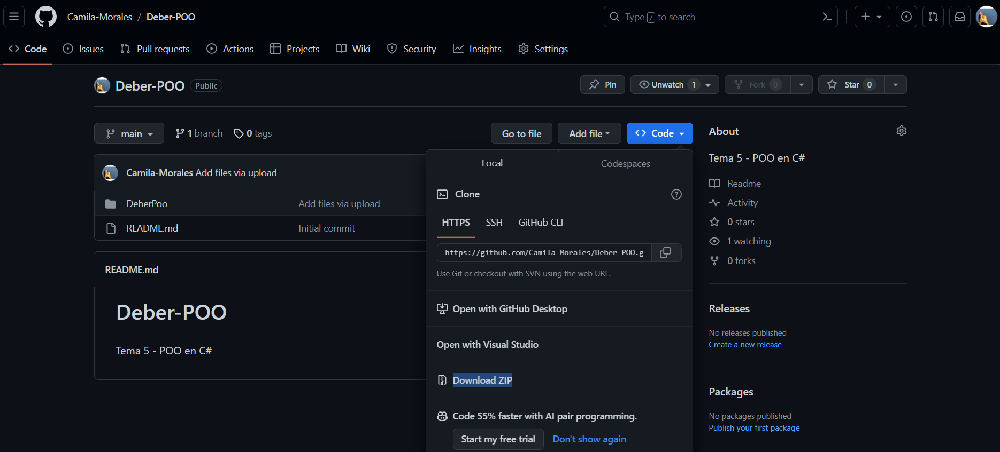

# POO C

## Requisitos

Tener instalado SDK y Visual Studio

## Pasos para ejecutar

1. Descargar el programa de Github
 
2. Abrir el programa en Visual Studio Code en la ruta del proyecto
 
3. Abrir una terminal
 
4. Ejecutar el siguiente codigo: `dotnet run`
 
5. Ingresar los datos solicitados en el programa
